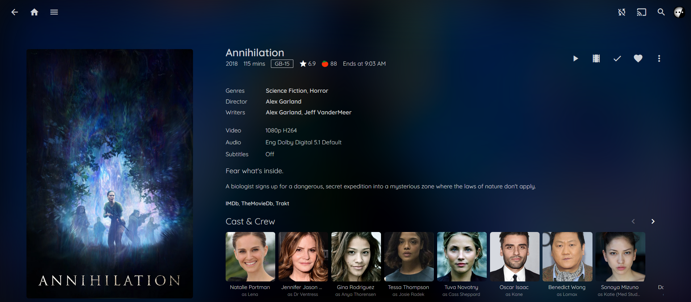

# Monochromic
A custom theme for Jellyfin mediaserver created using CSS overrides. 

To use the theme copy paste the line below into "Dashboard>General>Custom CSS" and click save, it will apply immediately server-wide to all users on top of any theme they may be using. To remove the theme, clear the "Custom CSS" field and then click save.
> @import url('https://ctalvio.github.io/Monochromic/default_style.css');

NOTE: This may not work when using reverse proxy, check below the screenshots for more info.

## Features
- Uses the same font as the JF logo everywhere
- Blurred backdrops
- Squared aesthetic with rounded corners
- Works well on mobile
- Strives to theme every element
- More compact
- Smaller and squared cast info

## Screenshots

## Using with reverse proxy

When using the Nginx Reverse proxy config from the [Jellyfin docs](https://jellyfin.org/docs/general/networking/nginx.html) the theme will not work by default. (If you are using the subpath config, you can ignore all this.)

Because the config includes Content-Security-Policy which reduces risk of XSS, you need to add the URL from this repo and the fonts to the list of allowed external sources.

In the nginx config you should change the
> add_header Content-Security-Policy ....

to:
> add_header Content-Security-Policy "default-src https: data: blob:; style-src 'self' 'unsafe-inline' https://ctalvio.github.io/Monochromic/default_style.css https://fonts.googleapis.com/css2; script-src 'self' 'unsafe-inline' https://www.gstatic.com/cv/js/sender/v1/cast_sender.js https://www.youtube.com/iframe_api https://s.ytimg.com https://ctalvio.github.io/Monochromic/default_style.css; worker-src 'self' blob:; connect-src 'self'; object-src 'none'; frame-ancestors 'self'";

If you don't do this the theme will simply not load (reverts back to default theme) and the browser console will spit out an error. Even if you paste in all the CSS, the font will still not load since it is loaded from an external source.

Thanks to [LickABrick](https://github.com/LickABrick) for discovering this, and submitting instructions on how to fix.
